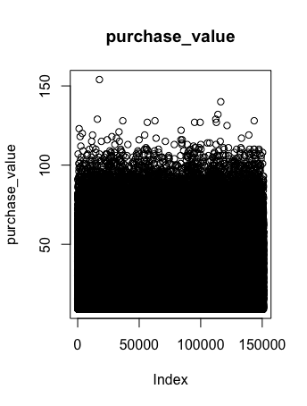

# Identifying-Fraudulent-Activities
Build a model to predict whether an activity is fraudulent and analyze performance via ROC/PR curve

# Project 3: Identifying Fraudulent Activities

## Challenge Description
Company XYZ is an e-commerce site that sells hand-made clothes.
You have to build a model that predicts whether a user has a high probability of using the site to perform some illegal activity or not. 
You only have information about the user first transaction on the site and based on that you have to make your classification ("fraud/no fraud").
These are the tasks you are asked to do:
1. For each user, determine her country based on the numeric IP address.
2. Build a model to predict whether an activity is fraudulent or not. Explain how different assumptions about the cost of false positives vs false negatives would impact the model.
4. Let's say you now have this model which can be used live to predict in real time if an activity is fraudulent or not. From a product perspective, how would you use it? That is, what kind of different user experiences would you build based on the model output?

Note:
comments are embedded in the code file

## EDA
I looked at the distribution the data and the values counts for the various numeric and categorical variables. Below are some highlights discoveries from the table. 

 

## Random Forest
Some highlights from random forest model.

## ROC & PR Curve
Some highlights from evaluation plots.

## CONCLUSION: 
We can try multiple prediction models and apply roc/pr curve and auc scores to evaluate their performance(in the fraudulent activities case, PR is more common and comprehensive). After the model building, we should discuss with the PM to set a cutoff point to determine which activity should be considered as fraudulent by suggestions from the curves. Meanwhile doing that, we might want to take users' experience into more consideration. That being said, the threshold should not be set too high, so that almost every users are predicted as fraud. We can achieve that by set the threshold relatively low and implement some indentity varification process in our website. For example, if the score is lower than 0.5, the customer is considered as normal user; if the score is higher than 0.5, but lower than 0.8, they should use an identity varification process to prove themselves clean; if the score is higher than 0.8, the users' purchasing or transfering process should be put on hold, until a customer service or IT department mannually prove that they are not frauds. 
